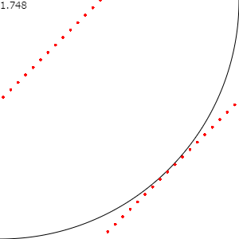

# 演習の解答例

## 演習 1

  See the Pen <a href="https://codepen.io/likr/pen/rNyYKNJ">
  コンピューティング2 演習4-1</a> by Yosuke Onoue (<a href="https://codepen.io/likr">@likr</a>)
  on <a href="https://codepen.io">CodePen</a>.

正確な確率は $$\frac{1}{2^5} \binom{5}{3} = \frac{5}{16} = 0.3125$$ なので大体近い数字が得られています。

## 演習 2

  See the Pen <a href="https://codepen.io/likr/pen/eYveKmy">
  コンピューティング2 演習4-2</a> by Yosuke Onoue (<a href="https://codepen.io/likr">@likr</a>)
  on <a href="https://codepen.io">CodePen</a>.

正確な確率は 75% なので、大体近い数字が得られています。

## 演習 3

  See the Pen <a href="https://codepen.io/likr/pen/wvJPXaG">
  コンピューティング2 演習4-3</a> by Yosuke Onoue (<a href="https://codepen.io/likr">@likr</a>)
  on <a href="https://codepen.io">CodePen</a>.

4 次元球の体積は $$\frac{\pi^2}{2} = 4.9348022\cdots$$ なので、大体近い数字が得られています。

## 演習 4

  See the Pen <a href="https://codepen.io/likr/pen/oNZoyjV">
  コンピューティング2 演習4-4</a> by Yosuke Onoue (<a href="https://codepen.io/likr">@likr</a>)
  on <a href="https://codepen.io">CodePen</a>.

## 演習 5

省略

## 演習 6

  See the Pen <a href="https://codepen.io/likr/pen/QWpOxKv">
  コンピューティング2 演習4-6</a> by Yosuke Onoue (<a href="https://codepen.io/likr">@likr</a>)
  on <a href="https://codepen.io">CodePen</a>.

$$a = 607, b=111, m=1024$$ のときの実行結果は以下のようになります。

パラメーターの選び方によっては点の偏りがあり、正しくシミュレーションができていないことが確認できます。
また、点の偏りがない場合でも点が格子状に並んでいて、規則性が見えます。

## 演習 7

  See the Pen <a href="https://codepen.io/likr/pen/xxqPzje">
  コンピューティング2 演習4-7</a> by Yosuke Onoue (<a href="https://codepen.io/likr">@likr</a>)
  on <a href="https://codepen.io">CodePen</a>.

## 演習 8

  See the Pen <a href="https://codepen.io/likr/pen/NWpwzBa">
  コンピューティング2 演習4-8</a> by Yosuke Onoue (<a href="https://codepen.io/likr">@likr</a>)
  on <a href="https://codepen.io">CodePen</a>.

2 つの確率変数がそれぞれ正規分布 $$N(\mu_1, \sigma_1^2)$$ と $$N(\mu_2, \sigma_2^2)$$ に従っているとき、それらの和は正規分布 $$N(\mu_1 + \mu_2, \sigma_1^2 + \sigma_2^2)$$ に従います。
すなわち、科目 A、B、C の平均点は正規分布 $$N(195, 150)$$ に従っており、出力結果と近い値になっています。。
（小数点以下を切り捨てているので厳密には異なります。）

## 演習 9

分布関数の逆関数は以下のようになります。

$$
F^{-1}(x) = \log \frac{x}{1 - x}
$$

これに基づいてプログラムを実装します。

  See the Pen <a href="https://codepen.io/likr/pen/NWpwzLa">
  コンピューティング2 演習4-9</a> by Yosuke Onoue (<a href="https://codepen.io/likr">@likr</a>)
  on <a href="https://codepen.io">CodePen</a>.

## 演習 10

  See the Pen <a href="https://codepen.io/likr/pen/JjWOZqP">
  コンピューティング2 演習4-10</a> by Yosuke Onoue (<a href="https://codepen.io/likr">@likr</a>)
  on <a href="https://codepen.io">CodePen</a>.

## 演習 11

  See the Pen <a href="https://codepen.io/likr/pen/xxqPzoK">
  コンピューティング2 演習4-11</a> by Yosuke Onoue (<a href="https://codepen.io/likr">@likr</a>)
  on <a href="https://codepen.io">CodePen</a>.

## 演習 12

  See the Pen <a href="https://codepen.io/likr/pen/GRWOGVW">
  コンピューティング2 演習4-12</a> by Yosuke Onoue (<a href="https://codepen.io/likr">@likr</a>)
  on <a href="https://codepen.io">CodePen</a>.

## 演習 13

  See the Pen <a href="https://codepen.io/likr/pen/zYZPagQ">
  コンピューティング2 演習4-13</a> by Yosuke Onoue (<a href="https://codepen.io/likr">@likr</a>)
  on <a href="https://codepen.io">CodePen</a>.

## 演習 14

  See the Pen <a href="https://codepen.io/likr/pen/ExWbpxq">
  コンピューティング2 演習4-14</a> by Yosuke Onoue (<a href="https://codepen.io/likr">@likr</a>)
  on <a href="https://codepen.io">CodePen</a>.

