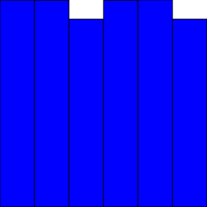
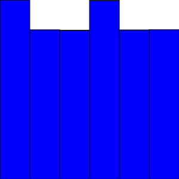

# 線形合同法

**線形合同法**（LCG; Linear Congruential Generators）は擬似乱数生成のアルゴリズムです。
線形合同法は一様乱数を生成します。

線形合同法の生成する乱数列 $$X_0, X_1, X_2, \cdots$$ は以下の式で表されます。

$$
X_{n + 1} = a X_n + b \mod m
$$

$$a, b, m$$ は乱数列を決定するためのパラメータです。
剰余演算を用いるため、$$X_n$$ の範囲は $$0 \leq X_n < m$$ となります。
また、$$X_0$$は乱数種となります。

$$X_n$$ を用いて $$Y_L$$ 以上 $$Y_U$$ 未満の実数値 $$Y_n$$ を生成するためには以下の変換式を用いることができます。

$$
Y_n = \frac{X_n}{m} (Y_U - Y_L) + Y_L
$$

# 線形合同法の実装

線形合同法による乱数生成プログラムの例は以下の通りです。
パラメーターは $$a = 5, b = 3, m = 16$$ に設定されています。

<p class="codepen" data-height="500" data-theme-id="light" data-default-tab="js,result" data-user="likr" data-slug-hash="LYWOBNG" data-preview="true" style="height: 500px; box-sizing: border-box; display: flex; align-items: center; justify-content: center; border: 2px solid; margin: 1em 0; padding: 1em;" data-pen-title="コンピューティング2 4-7">
  <span>See the Pen <a href="https://codepen.io/likr/pen/LYWOBNG">
  コンピューティング2 4-7</a> by Yosuke Onoue (<a href="https://codepen.io/likr">@likr</a>)
  on <a href="https://codepen.io">CodePen</a>.</span>
</p>
<script async src="https://cpwebassets.codepen.io/assets/embed/ei.js"></script>

$$m=16$$であるため、0 以上 16 未満の整数値が順不同に出力されています。
しかし、17 回目から 20 回目の出力結果が 1 回目から 4 回目の出力結果が一致していることに注目しましょう。
線形合同法では剰余演算を用いているため、このような法則性が現れます。

# 線形合同法の周期性

線形合同法は最大で $$m$$ 通りの整数値を生成します。
$$a, b, m$$ の選び方によっては、生成される値の種類が $$m$$ より小さくなる場合があります。

パラメーターを $$a = 7, b = 3, m = 16$$ に設定した場合の出力結果は以下のようになります。

```console
10
9
2
1
10
9
2
1
10
9
2
1
10
9
2
1
10
9
2
1
```

生成される値は 1, 2, 9, 10 の 4 通りのみとなっています。
また、10, 9, 2, 1, 10, 9, 2, 1 と 4 回ごとに同じパターンが出力されています。
このときに、この乱数列の周期が 4 であると言います。
乱数列の周期は長い方が望ましく、最大で $$m$$ となります。
周期はパラメーター $$a, b, m$$ の値によって決まります。

線形合同法を用いた乱数列で、6 面ダイスを振ったときの出た目の分布をヒストグラムで描画します。
パラメーターは $$a = 601, b=111, m=1024$$ としています。

<p class="codepen" data-height="500" data-theme-id="light" data-default-tab="js,result" data-user="likr" data-slug-hash="rNyYreE" data-preview="true" style="height: 500px; box-sizing: border-box; display: flex; align-items: center; justify-content: center; border: 2px solid; margin: 1em 0; padding: 1em;" data-pen-title="コンピューティング2 4-8">
  <span>See the Pen <a href="https://codepen.io/likr/pen/rNyYreE">
  コンピューティング2 4-8</a> by Yosuke Onoue (<a href="https://codepen.io/likr">@likr</a>)
  on <a href="https://codepen.io">CodePen</a>.</span>
</p>
<script async src="https://cpwebassets.codepen.io/assets/embed/ei.js"></script>

$$a = 607$$ に変更したときの結果は以下のようになります。



3 と 6 の出た回数が目に見えて少なくなっています。
パラメーターの設定の仕方によっては、このように正しく一様分布を生成することができません。

さらに `seed` を 5 に変更したときの結果は以下のようになります。



`seed` を変えても、分布は違うものの偏りが発生しています。

線形合同法には以下のようなメリット・デメリットが存在します。

- メリット
  - 実装が容易
  - 生成が高速
- デメリット
  - 生成される乱数列に法則性がある

よく知られている線形合同法の実装では $$m = 2^{32}$$ となっています。
それより多い個数の乱数が必要な場合は、その周期性に注意しましょう。
より予測困難な乱数が必要な場合は **メルセンヌツイスタ** などの他の乱数生成法を使用する必要があります。

# オーバーフローを考慮した線形合同法の実装

線形合同法は 0 以上 $$m$$ 未満の整数を発生させます。
線形合同法をプログラムで実装する場合には整数のオーバーフローに注意する必要があります。
$$m$$ が 2 のべき乗の場合、符号なし整数ではオーバーフロー部分を無視することができます。

JavaScript の数値を表す Number 型は IEEE 754 形式の 64 ビット浮動小数点数であるため、符号なし整数と同じ処理をプログラムで再現してみます。
そして、32 ビット の 符号あり整数型で表すことができる最大の値は 2147483647 です。
$$m = 2147483647$$ のとき、0 以上 2147483646 以下の整数値が生成されます。
$$b = 0$$ の場合の乱数生成について考えてみましょう。

$$T$$ を以下のように定義します。

$$
\begin{aligned}
q &= \left\lfloor \frac{m}{a} \right\rfloor \\
r &= m - a q \\
H &= \left\lfloor \frac{X_n}{q} \right\rfloor \\
L &= X_n - q H \\
T &= a L - r H
\end{aligned}
$$

このとき、

$$
a X_n \equiv T \mod m
$$

を満たします。

また、$$m > T \geq -m$$ となるので、$$X_{n + 1}$$ の更新式は以下のようになります。

$$
\begin{align}
X_{n + 1} \ = \begin{cases}
T & (T \geq 0) \\
T + m & (T < 0)
\end{cases}
\end{align}
$$

$$a = 48271$$ の場合のプログラムは以下のようになります。

<p class="codepen" data-height="500" data-theme-id="light" data-default-tab="js,result" data-user="likr" data-slug-hash="JjWOBbY" data-preview="true" style="height: 500px; box-sizing: border-box; display: flex; align-items: center; justify-content: center; border: 2px solid; margin: 1em 0; padding: 1em;" data-pen-title="コンピューティング2 4-9">
  <span>See the Pen <a href="https://codepen.io/likr/pen/JjWOBbY">
  コンピューティング2 4-9</a> by Yosuke Onoue (<a href="https://codepen.io/likr">@likr</a>)
  on <a href="https://codepen.io">CodePen</a>.</span>
</p>
<script async src="https://cpwebassets.codepen.io/assets/embed/ei.js"></script>
